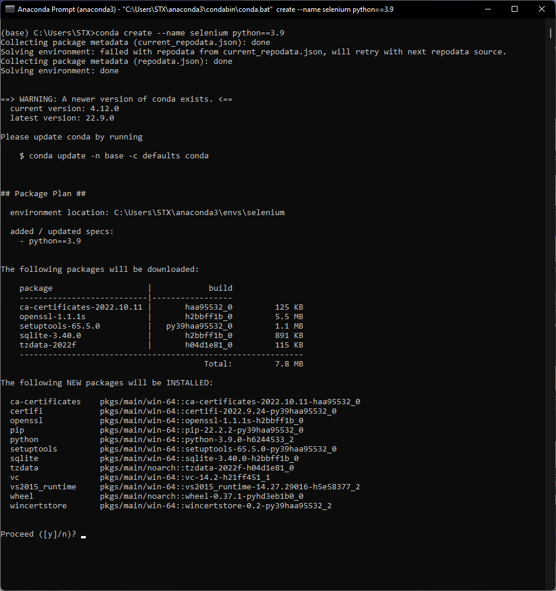
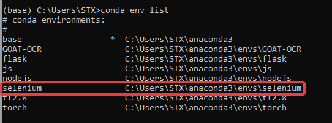
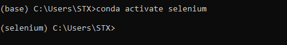

# Get-Start-with-Selenium
Welcome to the tutorial for selenium-python. \
In this tutorial, you will learn how to
 - Setup your python environment
 - Setup selenium
 - webscraping with selenium
 - Mimic a human user with selenium

# Set up your python environment
 - [step 1 - follow this website to install anaconda](https://www.anaconda.com/distribution/)
 - [step 2 - install PyCharm](https://www.jetbrains.com/pycharm/download/#section=windows)
 - step 3 - create a anaconda environment
   - [Anaconda Cheatsheet](https://docs.conda.io/projects/conda/en/4.6.0/_downloads/52a95608c49671267e40c689e0bc00ca/conda-cheatsheet.pdf)
   - Open Anaconda Prompt
```bash
conda create --name selenium python==3.9
```


   - step 4 - Check the list of environment
```bash
conda env list
```


   - step 5 - Activate the environment
```bash
conda activate selenium
```


   - step 6 - Install packages
```bash
# run command line by line
pip install selenium
pip install numpy
pip install pandas
pip install beautifulsoup4
pip install lxml
pip install requests
```